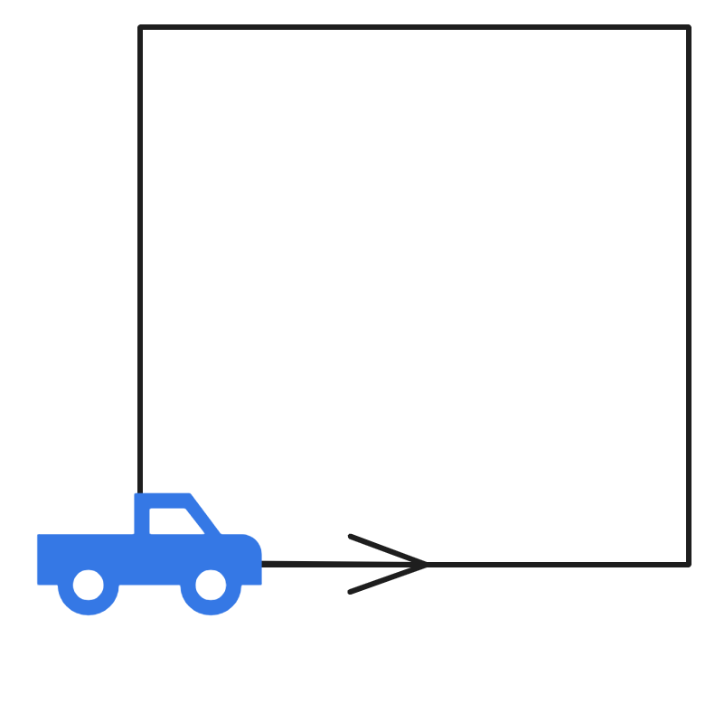
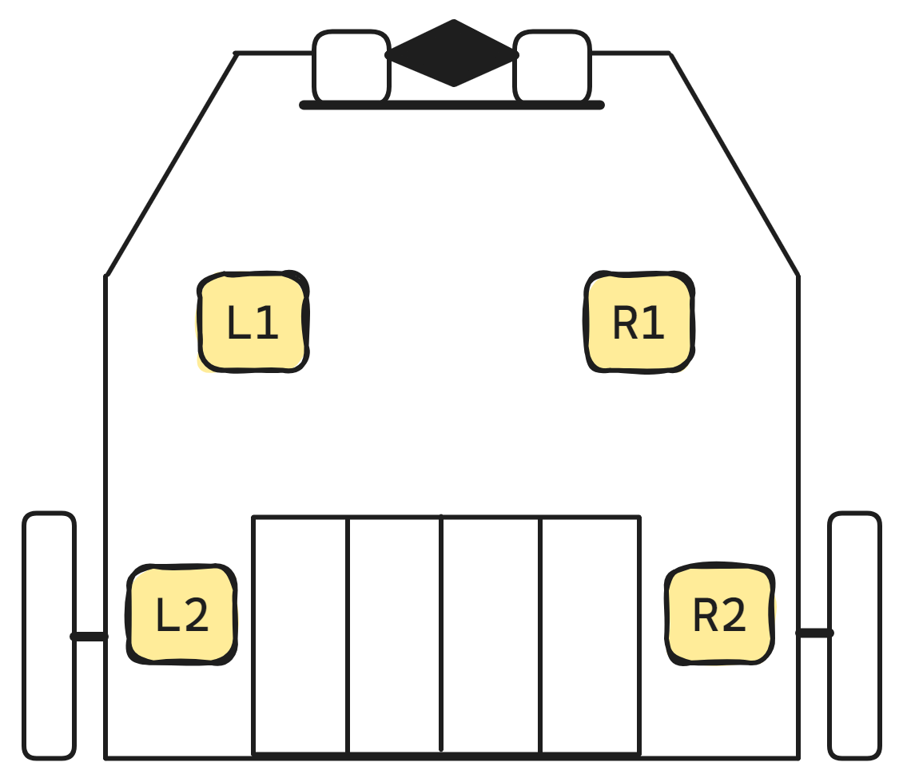
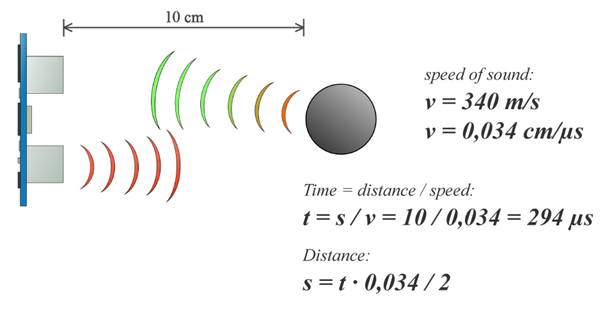

---
sidebar_custom_props:
  id: ed0bd05b-09ee-45d5-9cb5-4e8834aa5bb8
---
# Einstieg

:::aufgabe[Inbetriebnahme Maqueen]
<Answer type="state" webKey="0eff77c4-2629-4b69-bb87-2d0b1279e6f3" />

Dokumentation
: [👉 Installation](https://gbsl-informatik.github.io/maqueen-plus-v2-mpy/docs/)

Nehmen Sie den Maqueen gemäss folgender Anleitung in Betrieb. Für jedes Maqueen-Programm müssen diese Schritte zu Beginn durchgeführt werden. 

::video[./images/maqueen-intro.mp4]{autoplay loop}

1. Überprüfen Sie, dass der Maqueen nach rechts dreht, dann gerade aus fährt und anhält. 
2. Markieren Sie die Aufgabe als erledigt.
:::

:::def[Motoren `motor_run(motor, speed)`]
Lässt den gewählten Motor mit der angegebenen Geschwindigkeit laufen.

Die Geschwindigkeit kann zwischen `-255` und `255` liegen. Negative Werte bedeuten, dass der Motor rückwärts läuft.

Welcher Motor angesteuert wird, muss mit einer Zahl (oder der Konstantent aus `Motor`) angegeben werden:

Links
: `0` oder `Motor.LEFT`
Rechts
: `1` oder `Motor.RIGHT`
Beide
: `2` oder `Motor.ALL`

```py
# den linke Motor mit 100% Geschwindigkeit vorwärts drehen lassen
motor_run(0, 255)
# oder äquivalent
motor_run(Motor.LEFT, 255)

# den rechten Motor rückwärts mit 50% drehen lassen
motor_run(Motor.RIGHT, -128)

# beide Motoren vorwärts drehen mit 100%
motor_run(Motor.ALL, 255)
```

Referenz
: [👉 Dokumentation/motor#motor_runmotor-speed](https://gbsl-informatik.github.io/maqueen-plus-v2-mpy/docs/api/motor#motor_runmotor-speed)

:::


:::def[`sleep(ms)`]
Mit der Funktion `sleep(ms)` kann das Programm für eine bestimmte Anzahl Millisekunden angehalten werden.

Diese Funktion funktioniert im Browser leider nicht, auf dem Micro\:Bit jedoch schon (oder auch wenn Python lokal installiert ist). Während dem der Micro\:bit wartet/schläft, kann er keine anderen Befehle ausführen - sich drehende Motoren drehen sich aber in dieser Zeit weiter.

```py
from microbit import *
from maqueen import *

while True:
    motor_run(Motor.ALL, 255)
    sleep(1000) # wartet 1 Sekunde
    motor_run(Motor.ALL, -255)
    sleep(1000) # wartet 1 Sekunde
```
:::

:::def[Motor stoppen `motor_stop()`]

Mit `motor_stop()` können alle Motoren gestoppt werden. Optional kann auch nur ein Motor gestoppt werden.

```py
# stoppt beide Motoren
motor_stop()
# stoppt den linken Motor
motor_stop(0)
# oder äquivalent
motor_stop(Motor.LEFT)
```

Referenz
: [👉 Dokumentation/motor#motor_stop](https://gbsl-informatik.github.io/maqueen-plus-v2-mpy/docs/api/motor#motor_stop)
:::

:::warning[Geradeausfahern]
Die Drehgeschwindigkeit der Motoren wird über die Spannung gesteuert und ist leider nicht sehr präzise. Daher kann es sein, dass der Maqueen nicht geradeaus fährt, sondern eine Kurve macht - auch wenn bei beiden Motoren derselbe Zahlenwert eingestellt ist. Dies muss durch Ausprobieren und Anpassen der Geschwindigkeit der Motoren korrigiert werden.
:::

:::success[Hinweis Kurvenfahren]
Kurvenfahren kann durch unterschiedliche Geschwindigkeiten der linken- und rechten Motoren erreicht werden. Soll der Maqueen an Ort und Stelle drehen, so müssen die Motoren in entgegengesetzte Richtungen laufen.
:::


:::aufgabe[Quadrat fahren]
<Answer type="state" webKey="cac5a052-f977-4649-a918-214ecfe85c92" />

Schreiben Sie ein Programm, das den Maqueen ein Quadrat fahren lässt.



```mpy live_py id=320176d9-f2b5-4345-a576-2c04e333c192

```

<Solution webKey="48efdf30-68b3-4dee-8286-6c1aafe1309d">

#### Ansatz 1: Wiederholungen brauchen

```py
# Imports go at the top
from microbit import *
from maqueen import *

for i in range(4):
    motor_run(Motor.ALL, 255)
    sleep(1000)

    motor_run(Motor.RIGHT, 100)
    motor_run(Motor.LEFT, -100)
    sleep(1900)
motor_stop()
```
#### Ansatz 2: Funktionen schreiben, die man einfach anpassen kann

```py
from microbit import *
from maqueen import *

TIME_FOR_360 = 1900 # Zeit in ms um sich um 360° zu drehen (bei 100 Geschwindigkeit)
TIME_FOR_1M = 4000  # Zeit in ms um 1m zu fahren (bei 255 Geschwindigkeit)

def forward(distanz):
    motor_run(Motor.ALL, 255)
    sleep(distanz * TIME_FOR_1M)
    motor_stop()

def left(winkel):
    motor_run(Motor.RIGHT, 100)
    motor_run(Motor.LEFT, -100)
    sleep(winkel * TIME_FOR_360 / 360)
    motor_stop()

## Programm fürs Quadrat
for i in range(4):
    forward(0.25)
    left(90)
```

</Solution>

### ⭐ Zusatz
Ändern Sie das Programm so ab, dass der Maqueen an den Ecken jeweils eine zusätzliche 360 ° Drehung vollzieht.


```mpy live_py id=6187de79-61f4-4262-9a0e-034ff028904b

```

:::

## LED's

Der Maqueen hat mehrere LED's, die einzeln angesteuert werden können.

:::def[Farb-LED's]

Der Maqueen hat an der Unterseite 4 Farb-LED's.



```py
# alle Farb-LED's in rot einschalten
led_rgb(Color.RED)

# die LED vorne links auf grün setzen
led_rgb(Color.GREEN, ColorLED.L1)

# eigene RGB-Farbe vorn rechts setzen
led_rgb(rgb(255, 128, 0), ColorLED.R1)

# Blau für alle LED's bei einer Helligkeitsstufe 50 setzen.
led_rgb(Color.BLUE, brightness=50) # Ändert die globale Helligkeit nicht.
```

Referenz
: [👉 Dokumentation/led-rgb](https://gbsl-informatik.github.io/maqueen-plus-v2-mpy/docs/api/led-rgb#api)
:::

::::def[HSL-Farben]
Die Farben können auch in HSL (Hue, Saturation, Lightness) angegeben werden. Der Vorteil davon ist, dass die eigentliche Farbe auf einem Farbkreis definiert wird.


```mpy
from maqueen import *
led_rgb(hsl(  0, 100, 50)) # => LED's in rot
led_rgb(hsl(180, 100, 50)) # => LED's in cyan
```

:::warning[Lightness]
Die Lightness (letzter Parameter) gibt an, wie hell die Farbe ist. `0` ist schwarz, `100` ist weiss. Sollen satte Farben angezeigt werden, sollte die Lightness auf ca. `50` gesetzt werden.
:::

Dies ermöglicht es etwa, die Farbe abhängig vom Winkel zu setzen.

Referenz
: [👉 Dokumentation/led-rgb#hsl](https://gbsl-informatik.github.io/maqueen-plus-v2-mpy/docs/api/led-rgb#hsl)
::::

:::def[Modulo Operator `%`]
Der Modulo-Operator `%` gibt den genzzahligen Rest einer Division zurück. Dies ist immer dann nützlich, wenn eine Zahl in einem bestimmten Bereich gehalten werden soll.

#### Beispiele
```py live_py slim
# 5 modulo 2 ergibt 1, da 5 / 2 = 2 rest 1 ergibt
print(f'5 modulo 2 = {5 % 2}')
# gibt nacheinander 0, 1, 2, 0, 1, 2, 0, 1, 2, 0 aus
for i in range(10):
    print(f'{i} modulo 3 = {i % 3}')
```
:::

:::aufgabe[Farb-Disco]
<Answer type="state" webKey="5ad417e2-37f2-454b-9a3d-8727aa30983a" />

Studieren Sie den folgenden Code und passen Sie ihn so an, dass die Farben nach einer Umdrehung wieder auf rot gesetzt werden. Der Roboter soll sich unendlich lang drehen und dabei die Farben wechseln.

```mpy live_py id=48d2c03f-b4f2-4b98-ac20-20d1afeef380
from microbit import *
from maqueen import *

motor_run(Motor.LEFT, 20)
motor_run(Motor.RIGHT, -20)

angle = 0
while True:
    led_rgb(hsl(angle, 100, 50))
    angle = angle + 1
    sleep(10) # für 10 ms warten
```

#### Hilfestellungen
<Hint title="Hinweis 1">

Verwenden Sie den Modulo-Operator `%` um den Winkel auf 360 zu begrenzen.
</Hint>
<Hint title="Hinweis 2">

Stoppen Sie die Zeit, die für eine Umdrehung benötigt wird. Berechnen Sie damit, wie lange gewartet (`sleep`) werden muss, bis die Farbe nächste Farbe gesetzt wird.
</Hint>
<Hint title="Hinweis 3">

Berechnung der Wartezeit:
$$
\text{{Wartezeit}} = \frac{\text{Zeit für 360° in Sekunden} \cdot 1000}{360}
$$
</Hint>
:::

:::aufgabe[Ultraschall-Sensor und Mikrofon]
<Answer type="state" webKey="51858d69-2fe6-4a81-bbbe-2a0f7fd5d576" />

Mit dem Ultraschall-Sensor kann die Entfernung zu einem Objekt gemessen werden. Dabei werden Ultraschallwellen ausgesendet und die Zeit gemessen, bis das Echo zurückkommt.



Zum Glück müssen Sie sich nicht um die genaue Berechnung kümmern, sondern können die Funktion `ultrasonic()` verwenden, was die Entfernung in `cm` zurückgibt.

1. Studieren Sie die rudimentäre Hinderniserkennung im Code-Beispiel auf der Webseite: [👉 Hinderniserkennung](https://gbsl-informatik.github.io/maqueen-plus-v2-mpy/docs/examples/obstacle-avoidance)
2. Probieren Sie den Code aus und halten Sie fest, wie der Algorithmus funktioniert. Insbesondere, wie der Drehwinkel des Maqueen eingestellt wird.
    <Answer type="text" webKey="0bc69733-d362-42b3-b9f1-7c9b35c84218" />
3. Ändern Sie das Programm so ab, dass der Maqueen auch die Richtung wechselt, wenn in die Hände geklatscht wird (was pauschal einem lauten Geräusch entspricht). Lesen Sie dazu die Dokumentation zum Mikrofon: [👉 Mikrofon](https://python.microbit.org/v/3/reference/microphone)

```mpy live_py id=76d88313-309d-40a2-a79d-1f33b97202ff

```
:::

:::aufgabe[Ultraschall Lead-and-Follow]
<Answer type="state" webKey="25293200-bca2-4590-82a2-39f66d12f85f" />

Schreiben Sie ein Programm, bei welchem der Maqueen immer `10 cm` Abstand zu Ihrer Hand hält. Ist die Distanz kleiner, fährt der Maqueen rückwärts, ist die Distanz grösser, fährt er vorwärts. Eine Richtungsänderung erfolgt dabei nie.

::video[./images/lead-and-follow.mp4]{autoplay loop}


```mpy live_py id=a68792f6-f832-4d74-9d9e-80ee1d2762e6

```
:::