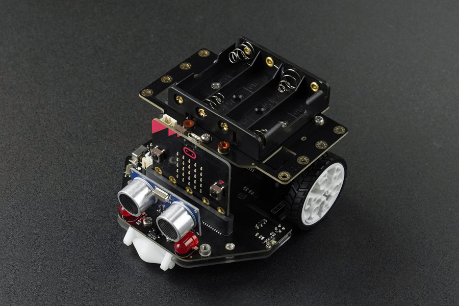

---
sidebar_custom_props:
  id: fab73c35-51dd-4e9f-b830-a4998a0b919f
---
# Robotik

Micro\:Bit Editor
: 👉 [https://python.microbit.org/v/3](https://python.microbit.org/v/3)
Maqueen Bibliothek
: 👉 [https://gbsl-informatik.github.io/maqueen-plus-v2-mpy/](https://gbsl-informatik.github.io/maqueen-plus-v2-mpy/)

:::cards{columns=2}

::br

:::

:::info[Wettbewerb]
Ziel
: Bewältigung eines Parcours mit Hindernissen
Gruppengrösse
: 2 Personen
Note
: Zählt 0.5
Abgabe
: Code und Kurzbeschreibung
: Fr. 10.5.24 bis 22:00 Uhr
:::

:::note[:mdi[apple] iPad und Micro\:Bit]
Mit dem iPad kann der Micro\:Bit nicht direkt programmiert werden. Es ist jedoch möglich, den Code auf dem iPad zu schreiben und dann wie folgt auf den Micro\:Bit zu übertragen:

Anleitung
: [👉 support.microbit.org](https://support.microbit.org/support/solutions/articles/19000139629-python-editor-using-the-micro-bit-ios-app-to-flash-the-micro-bit-with-an-ipad)
iOS App
: [👉 App Store](https://apps.apple.com/gb/app/micro-bit/id1092687276)
:::

:::info[Beurteilungskriterien]
Die Note setzt sich zusammen aus dem praktischen Teil und dem Bericht. Die Note zählt 0.5.

Praktischer Teil
: Für die Note zählen die umgesetzten Funktionalitäten des Roboters
: Gewichtung: 70 %

Bericht
: Tagebucheinträge (mind. 3) - was haben Sie gemacht, was hat funktioniert, was nicht? Welche Überlegungen stecken hinter den umgesetzten Funktionalitäten? (Welche Idee steht bspw. hinter dem "Blinken-Feature"?) Pro Eintrag ca. 1/4-1/2 Seite.
: Code: Der Code ist kommentiert und nachvollziehbar
: Gewichtung: 30 %

Wettbewerb
: Wer bewältigt den Parcours am schnellsten?
:::

### Punkteskala

```py live_py slim
punkte = 6 # erreichte Punkte
note = min(6, (punkte / 10) * 5 + 1)
print('Note:', note)
```

Mögliche Punkte
- Parcour bewältigt, ohne manuellen Eingriff (6 Punkte)
- Parcour bewältigt, mit manuellem Eingriff (4 Punkte)
- Der Roboter blinkt während der Fahrt in verschiedenen Farben (1 Punkt)
- Der Roboter kann einem Hindernis ausweichen und findet die Fahrtstrecke wieder (2 Punkte)
- Der Roboter dreht sich um 360 ° wenn geklatscht wird (1 Punkt)
- Der Roboter findet den Weg zum Ziel, auch wenn Einbahnstrassen vorhanden sind (1 Punkte)
- Der Roboter zeigt auf dem Display mit einem Pfeil an, ob er aktuell links, rechts oder gerade steuert. (1 Punkt)