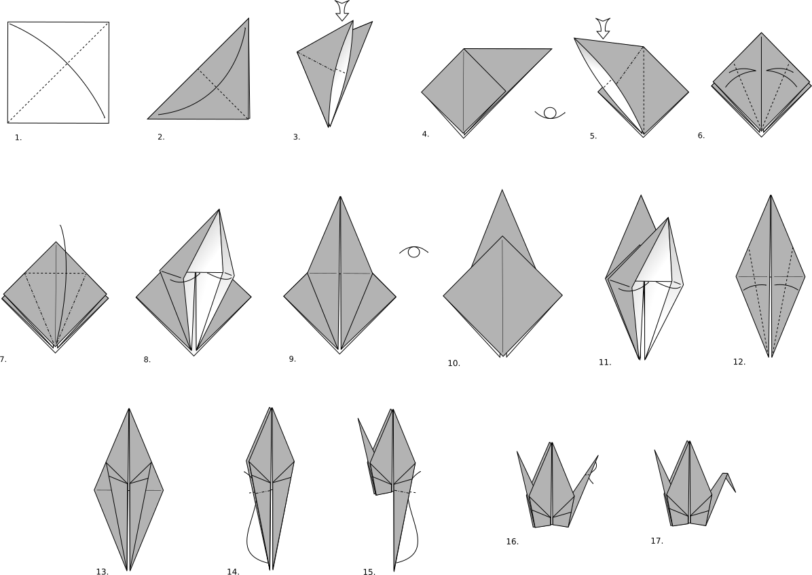

# Faltanleitung [^1]

Eine Faltanleitung ist ein Beispiel für einen Algorithmus. Das japanische Wort Origami bezeichnet die Kunst des Papierfaltens.

## Schritt
In einer Faltanleitung kommen nur wenige Arten von Schritten vor:

- **Falten**: Durch eine gestrichelte Linie wird angedeutet, wo gefaltet werden soll. Der Pfeil gibt an, in welche Richtung gefaltet wird.
- **Falz machen**: Durch Hin- und Zurückfalten wird ein Falz erzeugt. Dies wird durch einen Pfeil angedeutet, der hin und zurück zeigt.
- **Drehen**: Durch einen Pfeil zwischen zwei Abbildungen wird angezeigt, dass das Papier entsprechend umgedreht werden soll.

## Beispiele
### Schachtel

Eine einfache Faltanleitung für eine Schachtel.

### Kranich

Der Kranich ist das klassische Motiv im japanischen *Origami*.

[^1]: Quelle: [rothe.io](https://rothe.io/?page=prog1/1-algo/2-origami/)