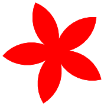

import Strukto from '@site/src/components/struktogramm/Strukto';

# Unterprogramme [^1]

## Einführung
In einer Bildkomposition kommen Figuren wie Dreiecke und Quadrate mehrmals vor. Die Turtle weiss aber nicht, was ein Dreieck oder ein Quadrat ist. Da in der Bildkomposition die Dreiecke und Quadrate nicht systematisch angeordnet sind, ist die Verwendung von Wiederholungen hier nicht naheliegend.


:::cards --min-width=250px
***--code
```py live_py slim
from turtle import *

fillcolor('red')
begin_fill()
for i in range(3):
    forward(50)
    left(120)
end_fill()

left(120)

fillcolor('green')
begin_fill()
for i in range(3):
    forward(50)
    left(120)
end_fill()

left(120)

fillcolor('blue')
begin_fill()
for i in range(3):
    forward(50)
    left(120)
end_fill()
```
***--alignSelf=center

:::

**26 Zeilen Code?? Geht das nicht auch einfacher?**

**Es geht einfacher!** Es lassen sich nämlich neue Befehle festlegen, die z.B. ein Dreieck oder ein Quadrat zeichnen. 

:::flex --min-width=200px gap=50px
```py live_py slim
from turtle import *

def dreieck():
    begin_fill()
    for i in range(3):
        forward(50)
        left(120)
    end_fill()

fillcolor('red')
dreieck()

left(120)

fillcolor('green')
dreieck()

left(120)

fillcolor('blue')
dreieck()
```
***--align-self=end
<Strukto program={[
    {
        type: 'def', 
        code: <span>dreieck</span>,
        block: [
            {type: 'step', code: <span>Starte Auffüllen</span>},
            {
                type: 'repeat',
                code: <span><u>3</u> mal wiederholen</span>,
                block: [
                    {type: 'step', code: <span><u>50</u> Schritte vorwärts</span>},
                    {type: 'step', code: <span><u>120</u>° nach links</span>}
                ]
            },
            {type: 'step', code: <span>Ende Auffüllen</span>}
        ]
    },
    {type: 'step', code: <span><u>rote</u> Füllfarbe</span>},
    {type: 'call', code: 'dreieck zeichnen'},
    {type: 'step', code: <span><u>120</u>° nach links</span>},
    {type: 'step', code: <span><u>grüne</u> Füllfarbe</span>},
    {type: 'call', code: 'dreieck zeichnen'},
    {type: 'step', code: <span><u>120</u>° nach links</span>},
    {type: 'step', code: <span><u>blaue</u> Füllfarbe</span>},
    {type: 'call', code: 'dreieck zeichnen'}
]} />
:::

:::info Vorteile
Voilà - und es hat im gleichen Zug auch noch den Vorteil, dass eine Änderung (bspw. die Grösse des Dreiecks) nur an einem einzigen Ort vorgenommen werden muss.
:::

## Eigene Befehle definieren

:::def `def name():`
Mit `def name():` wird ein neues Unterprogramm (ein neuer Befehl) definiert. Als Name sollte immer etwas gewählt werden, das die Tätigkeit dieser Sequenz widerspiegelt. Alle Anweisungen, die zum neuen Befehl gehören, müssen eingerückt sein.

**Beispiel:**

```py
def zick_zack():
    left(45)
    forward(50)
    right(90)
    forward(50)
    left(45)
```

:::caution
Die Definition alleine führt das Programm noch nicht aus. Dazu muss der Befehl erst noch **aufgerufen** werden.
:::
:::

---

:::aufgabe

1. Erzeugen Sie ein Programm gemäss folgendem Struktogramm:

:::cards

<Strukto program={[
    {
        type: 'def', 
        code: <span>stufe</span>,
        block: [
            {type: 'step', code: <span><u>95</u>° links</span>},
            {type: 'step', code: <span><u>20</u> Schritte vorwärts</span>},
            {type: 'step', code: <span><u>95</u>° rechts</span>},
            {type: 'step', code: <span><u>30</u> Schritte vorwärts</span>}
        ]
    },
    {type: 'step', code: <span><u>100</u> Schritte vorwärts</span>},
    {type: 'call', code: 'stufe zeichnen'},
    {type: 'call', code: 'stufe zeichnen'},
    {type: 'call', code: 'stufe zeichnen'}
]} />
***--code
```py live_py title=befehl1.py id=e8dc1f0a-d2b6-4a2a-9461-e8cc96811530
from turtle import *
```
:::

2. Ändern Sie obiges Programm so, dass der Winkel einer Stufe neu `110°` beträgt.
3. Zeichnen Sie eine Treppe mit 30 Stufen. Denken Sie dabei auch an das letzte Kapitel. 

:::

:::aufgabe Aufgabe 1 – Sechsecke

:::cards
***--code --flex-grow=2
```py live_py title=sechseck.py id=6d4c82e3-ecaa-486e-a756-3a1a1a8a70fc
from turtle import *

```
***--flex-grow=1 --max-height=500px --overflow-y=auto
1. Zeichnen Sie ein Sechseck


2. Verschieben Sie die Sequenz, die das Sechseck zeichnet, in einen neuen Befehl namens `sechseck()`. Denken Sie daran, der neue Befehl muss aufgerufen werden, damit er ausgeführt wird.
3. Verwenden Sie den neuen Befehl, um die folgende Figur zu zeichnen, welche aus 10 Sechsecken besteht: 


<details><summary>Tipp</summary>

Nach jedem Sechseck muss `36°` gedreht werden.

</details>
:::
:::

:::aufgabe Aufgabe 2 – Häuser

:::cards
***--code --flex-grow=2
```py live_py title=stadt.py id=b5c82672-65db-4725-8ec9-7a80ac835b3d
from turtle import *

```
***--flex-grow=1 --max-height=500px --overflow-y=auto
1. Definieren Sie einen Befehl `haus()`, der ein Haus des Nikolaus zeichnet:


2. Zeichnen Sie nun 4 Häuser nacheinander in unterschiedlichen Farben.


:::

:::

:::aufgabe Aufgabe 3 – Blume
Sie werden in dieser Aufgabe unter der Verwendung mehrerer Unterprogramme eine komplexe Aufgabe schrittweise lösen.

:::cards
***--code --flex-grow=2
```py live_py title=blume.py id=b47c6d09-11ca-4bff-b676-09cb0d7399bf
from turtle import *

```
***--overflow-y=auto --max-height=550px --flex-grow=1
1. Definieren Sie Unterprogramm `bogen()`, mit dem die Turtle einen Bogen zeichnet und sich dabei insgesamt um `90°` nach rechts dreht.

    
2. Fügen Sie einen weiteren Befehl `blumenblatt()` hinzu, welches zwei Bögen zeichnet. Die Turtle sollte am Ende aber wieder in Startrichtung stehen.

    
3. Ergänzen Sie `blumenblatt()` so, dass ein rot gefülltes Blatt gezeichnet wird. Setzen Sie mit [`pencolor`](100-turtle-commands.md#pencolorcolor) die Stiftfarbe ebenfalls auf rot, damit die Umrandungslinie die gleiche Farbe hat.

    
4. Erweitern Sie das Programm mit dem Befehl `blume()`, so dass eine fünfblättrige Blume gezeichnet wird.

    

5. ⭐️ Zusatz: Blume mit Stiel. Ergänzen Sie die Blume mit einem Stiel.

    
:::
:::


[^1]: Inspiration: [rothe.io](https://rothe.io/?b=prog1&p=416425)