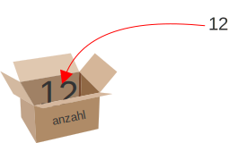

import PyOps from '@site/docs/Programmieren-1/03-Python/_def-python-operatoren.md';
import Strukto from '@site/src/components/struktogramm/Strukto';
import PyTemplateString from '@site/docs/Programmieren-1/03-Python/_def-python-template-string.md';

# 7. Variablen

## Einführung
Im vorhergehenden Kapitel haben Sie Quadrate gezeichnet, deren Seitenlänge im Programm fest eingebaut waren. Manchmal möchten Sie aber die Seitenlänge mit einem Eingabedialog einlesen. Dazu muss das Programm die eingegebene Zahl als Variable speichern.
Variablen kann man sich wie eine Zügelbox vorstellen, welche mit einem Namen angeschrieben ist. Der Name beschreibt, was sich in der Box befindet, damit man den Inhalt später auch wieder findet.



Mit der Schreibweise `anzahl = 12` wird eine solche Box erstellt. In Zukunft sagen wir, dass damit die Variable `anzahl` **definiert** und ihr einen **Wert zugewiesen** wird. Um den Inhalt der Box zu erhalten, kann der Name (ohne Anführungszeichen) geschrieben werden. Im Struktogramm werden alle Variablen **umrahmt**.

:::flex --width=250px
<Strukto program={[
    {type: 'step', code: <span><span className="var">anzahl</span> = 12</span>},
    {type: 'step', code: <span>Ausgabe: <span className="var">anzahl</span></span>}
]} />
***

```py live_py slim
anzahl = 12

print(anzahl)
```
:::

**Mit Variablen rechnen**
```py live_py slim
anzahl = 12
print(anzahl + 13)
```
**Mehrere Variablen**
```py live_py slim
anzahl = 12
gewicht = 100
print(f'{anzahl} Tafeln Schokolade sind {anzahl * gewicht} g schwer')
```

<details><summary>Formatierter Text: <code>f'{'{'}anzahl{'}'} Tafeln'</code></summary>

### Formatierter Text

<PyTemplateString />

</details>

## Überschreiben: Variablen neu Zuweisen 
In einer Box kann immer nur ein einziges Objekt abgelegt werden. Wenn später also ein neuer Wert in bereits beschriftete Zügelbox gelegt wird, so wird der aktuelle Wert verdrängt. Künftig wird diese erneute Zuweisung **Überschreiben einer Variable** genannt.


```py live_py slim
anzahl = 12
print(f'Anzahl = {anzahl}')
anzahl = 7
print(f'Anzahl = {anzahl}')
```

Im obigen Beispiel wird der initiale Wert der Variable `anzahl` (12) mit dem neuen Wert `7` überschrieben.

:::finding Merke: Gültigkeitsbereich
Die Variable wird nicht rückwirkend verändert. Solange eine Variable nicht überschrieben wird, besitzt sie den aktuell zugewiesenen Wert.
:::

:::aufgabe
Was geschieht im untenstehenden Programm? Fügen Sie bei jeder Zeile mit einem `print` einen Kommentar hinzu mit:
- ausgegebene Zahl
- aktuell gespeicherter Wert in der Variable `anzahl`

```py live_py id=d22582be-acf8-4a7d-b370-449a92b44b2b title=variable.py
anzahl = 2
print(anzahl)       # => 2, anzahl=2
print(anzahl + 2)

anzahl = 7
print(anzahl)
print(anzahl + 2)

anzahl = anzahl + 3
print(anzahl)

anzahl = anzahl + 3
print(anzahl + 1)

anzahl = anzahl + 3
print(anzahl)
```
:::

:::finding Gleichheitszeichen
Das Gleichheitszeichen hat also in Computerprogrammen nicht dieselbe Bedeutung wie in der Mathematik. Es ist keine Gleichung, sondern eine Variablendefinition oder eine Zuweisung.
:::

# Variablenwert einlesen, verändern und ausgeben

Im Programm kann mit Hilfe einer **Eingabeboxen** Werte eingelesen und einer Variable zugewiesen werden.

```py live_py slim
from turtle import *
speed(12)

anzahl = input("Wie viele Strecken soll die Spirale haben?")
anzahl = int(anzahl)

seite = 10
for i in range(anzahl):
    forward(seite)
    left(90)
    seite = seite + 10
```

:::tip Eingabe
In Python ist das Resultat einer Eingabe **immer ein Text**. Ein Text kann aber in eine Zahl umgewandelt werden, so dass dann auch damit gerechnet werden kann.
- Der Befehl `int` wandelt eine Eingabe in eine **ganze Zahl** um.
- Der Befehl `float` wandelt eine Eingabe in eine **Dezimalzahl** um.
:::

:::flex --width=450px
```py live_py slim
# Centimeter zu Meter
grösse = input('Wie gross bist du [cm]?')
grösse = int(grösse)
print(f'Ich bin {grösse / 100} m gross')
```
***
```py live_py slim
# Meter zu Centimeter
grösse = input('Wie gross bist du [m]?')
grösse = float(grösse)
print(f'Ich bin {grösse * 100} cm gross')
```
:::

### Eingabe - Struktogramm

Wird ein Wert über eine Eingabeaufforderung eingelesen, so wird dies im Struktogramm mit einem **Parallelogramm** angezeigt, wobei auch die Variable, welcher das Resultat zugewiesen wird, festgehalten wird:

:::flex --width=250px
<Strukto program={[
    {type: 'input', code: <span><span className="var">grösse</span> = Wie gross bist du [cm]?</span>},
    {type: 'step', code: <span>Ausgabe: Ich bin <span className="var">grösse</span> cm gross.</span>}
]} />
***

```py live_py slim
grösse = input('Wie gross bist du [cm]?')
print('Ich bin', grösse, 'cm gross')
```
:::

:::aufgabe Aufgabe 1 - BMI
Übersetzen Sie das folgende Struktogramm in Python Code:

:::flex --width=250px

<Strukto program={[
    {type: 'input', code: <span><span className="var">grösse</span> = Wie gross bist du [m]?</span>},
    {type: 'input', code: <span><span className="var">gewicht</span> = Wie schwer bist du [kg]?</span>},
    {type: 'step', code: <span><span className="var">bmi</span> = <span className="var">gewicht</span> geteilt durch <span className="var">grösse</span> mal <span className="var">grösse</span> </span>},
    {type: 'step', code: <span>Ausgabe: Bmi: <span className="var">bmi</span></span>}
]} />
***

```py live_py title=bmi.py id=a2442706-c582-4d76-a347-f91e50f5d3b6
```
:::

:::note Hinweis
Was ist die Bedeutung des folgenden Fehlers?
```error
TypeError: Can't multiply sequence by non-int of type 'str'
```
→ Der eingegebene Text kann nicht multipliziert werden - zuerst müssen `gewicht` und `grösse` in Dezimalzahlen (`float`) umgewandelt werden: `gewicht = float(gewicht)`.
:::
:::

:::aufgabe Aufgabe 2 – `n-Eck`
Nach Eingabe der Anzahl Ecken in einer Eingabebox soll die Turtle ein regelmässiges n-Eck zeichnen. Beispielsweise wird nach der Eingabe `8` ein 8-Eck gezeichnet. Den passenden Drehwinkel soll das Programm berechnen. 

```py live_py title=n-eck.py id=5e60a1fd-0c9c-4f6c-9e28-5455e7500d0c
from turtle import *

```
:::

:::aufgabe Aufgabe 3
Nach der Eingabe eines Winkels in einer Eingabebox zeichnet die Turtle `30` Strecken der Länge `100`, wobei sie nach jeder Strecke um den gegebenen Winkel nach links dreht. Experimentieren Sie mit verschiedenen Winkeln und zeichnen Sie schöne Figuren.

Mit `speed(10)` können Sie das Zeichnen beschleunigen.

```py live_py title=star.py id=d6f4d7f5-1deb-4031-82bc-c9482369477e
from turtle import *
```
:::