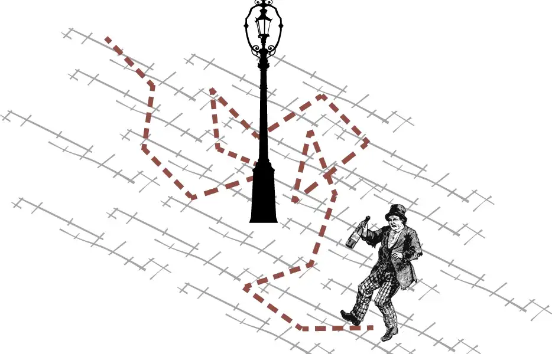

---
sidebar_custom_props:
  id: 0509a9e7-4000-4709-8cce-3c1a77090a8c
---
# Random Walk

> Die Random-Walk-Theorie wurde zunächst von der französischen Mathematikerin Louise Bachelier entworfen, die glaubte, dass Aktienkursentwicklungen wie die Schritte eines Betrunkenen seien: unberechenbar. [^1]



Betrachten wir den vermeintlich zufälligen Weg einer Ameise, die jeweils nach einer unbekannten Anzahl Schritten die Richtung wechselt. Wir schauen uns die ersten 20 Richtungswechsel an und überlegen uns, ob die Ameise von einer runden Tischplatte mit 100 cm Radius herunterfallen würde.


:::aufgabe Ameise.py
<Answer type="state" webKey="15ab7fbf-1cb8-4614-a1c3-4508dd131d6a" />

Simulieren Sie den zufälligen Weg einer Ameise, die **20** mal die Richtung wechselt.

Folgende Annahmen werden getroffen:
- die Ameise macht mindestens **4**, aber maximal **20** Schritte in dieselbe Richtung
- die Ameise dreht sich jeweils zwischen **0** und **360** Grad

```py title=ameise.py live_py id=9f60410a-dc94-4b45-9142-db25ea604d13
from turtle import *
from random import randint

# Tischplatte zeichnen
pencolor('red')
penup()
goto(0, -100)
pendown()
circle(100)
pencolor('black')

# Random walk
```

<Hint>

Mit `randint(start, ende)` können Sie einen zufälligen Wert im Bereich zwischen `start` und `ende` erzeugen.

```py live_py slim
from random import randint

print('Zufallszahl [0, 2]', randint(0, 2))
print('Zufallszahl [10, 20]', randint(10, 20))
print('Zufallszahl [-20, 5]', randint(-20, 5))
```

</Hint>

**Zusatz 1:**

Simulieren Sie 30 Ameisen - wie viele fallen vom Tisch?

**Zusatz 2:**

Mit `distance(0, 0)` kann die Distanz zum Ursprung ausgegeben werden - zeigen Sie jeweils die Distanz zum Ursprung mit an.

<Solution webKey="1c9975fe-be2e-499f-b907-fb648fb5e3a1">

```py live_py slim
from turtle import *
from random import randint

# Tischplatte zeichnen
speed(0)
color('red')
penup()
goto(0, -100)
pendown()
circle(100)
pencolor('black')

# Random walk...
def step():
    winkel = randint(0, 360)
    step = randint(1, 20)
    left(winkel)
    forward(step)

for versuch in range(30):
    penup()
    home()
    pendown()
    for i in range(20):
        step()
    print(versuch + 1, distance(0, 0) > 100, distance(0, 0))
```

</Solution>

:::


[^1]: Quelle: [Gloassar](https://www.ig.com/ch/trading-glossar/random-walk-theory-definition)
