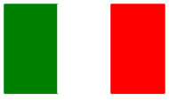

import Solution from '@site/src/components/Solution'
import Strukto from '@site/src/components/struktogramm/Strukto';

# Test 25h

<Solution webKey="9b210a53-d07e-4847-a355-65dd210192e6" title="Testfragen" open>

## Aufgabe 1
*(3 Punkte)*

Das Programm zeichnet einen 5er Stern.
1. Ändern Sie das Programm so ab, dass es nun einen 7er Stern zeichnet.
2. Füllen Sie den Stern mit Ihrer Lieblingsfarbe.

```py live_py title=aufgabe1.py id=91bd2392-e7fc-40b4-945f-fce6e24e4daf versioned
from turtle import *
speed(0)

for i in range(5):
    forward(80)
    left(3 * 360 / 5)
```


## Aufgabe 2
*(3 Punkte)*

Übersetzen Sie das untenstehende Struktogramm in Python Code

:::cards --max-width=400px
<Strukto program={[
    {type: 'step', code: <span><u>90</u>° links</span>},
    {type: 'step', code: <span><u>150</u> Schritte vorwärts</span>},
    {
        type: 'def', 
        code: <span>linie</span>,
        block: [
            {type: 'step', code: <span><u>50</u> Schritte vorwärts</span>},
            {type: 'step', code: <span><u>30</u>° rechts</span>},
            {type: 'step', code: <span><u>50</u> Schritte vorwärts</span>},
            {type: 'step', code: <span><u>30</u>° links</span>},
        ]
    },
    {
        type: 'def', 
        code: <span>dreieck</span>,
        block: [
            {
                type: 'repeat', 
                code: <span><u>3</u> mal wiederholen</span>,
                block: [
                    {type: 'call', code: 'linie zeichnen'},
                    {type: 'step', code: <span><u>120</u>° links</span>}
                ]
            }
        ]
    },
    {type: 'call', code: 'dreieck zeichnen'},
    {type: 'step', code: <span><u>120</u>° rechts</span>},
    {type: 'call', code: 'dreieck zeichnen'},
    {type: 'step', code: <span><u>120</u>° rechts</span>},
    {type: 'call', code: 'dreieck zeichnen'}
]} />
:::

```py live_py title=aufgabe2.py versioned id=4b72a23e-4835-42da-bc65-4142b8aa59fa
from turtle import * 
```

## Aufgabe 3
**(3 Punkte)**

Finden und korrigieren Sie alle Fehler, so dass die folgende Ausgabe entsteht. Es gibt sowohl Syntaxfehler wie auch Logikfehler.



```py live_py title=aufgabe3.py id=ed0a9530-ec45-49be-9c50-eb612e4ee8f3 versioned
from turtle import *

def streifen(farbe):
    color('farbe')
    beginn_fill()
    for i in() range(2)
        forward(60)
        left(90)
        forward(100)
        left(90)
    forward(100)
    end_fill

streifen('Grün')
 streiffn('white')
streifen('red')

hide_turtle()
```
## Aufgabe 4
*(4 Punkte)*

Schreiben Sie ein Programm, welches folgende Zeichnung erzeugt. Die Seitenlänge eines Zick-Zacks ist `20` Einheiten gross, der Innenwinkel beim Zick-Zack beträgt `60°`. *(2.5 Punkte)*
- Verwenden Sie Wiederholungen (*0.5 Punkte*)
- Schreiben Sie für das Zeichnen einer einzelnen Zacke einen (selber definierten) Befehl `zickzack` (*1 Punkt*).


```py live_py title=aufgabe4.py versioned id=c6d2731d-bbd8-42cc-971a-bc8ee6303f21
from turtle import *
```

---

## Zusatzaufgabe
*(Wird für das Erreichen der Note 6 nicht benötigt, 2 Punkte)*

Auf https://de.acervolima.com/zeichnen-sie-herz-mit-turtle-graphics-in-python/ finden Sie Python-Code, welcher ein Herz zeichnet.

- Räumen Sie den Code auf
- Schreiben Sie Ihren eigenen Namen in das Herz
- Machen Sie den Rand einen Stift der Breite `10` 

```py live_py title=zusatzaufgabe.py id=400ec5b0-ac1b-47b9-96c0-0f37ad8c7731 versioned

```

</Solution>
