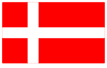
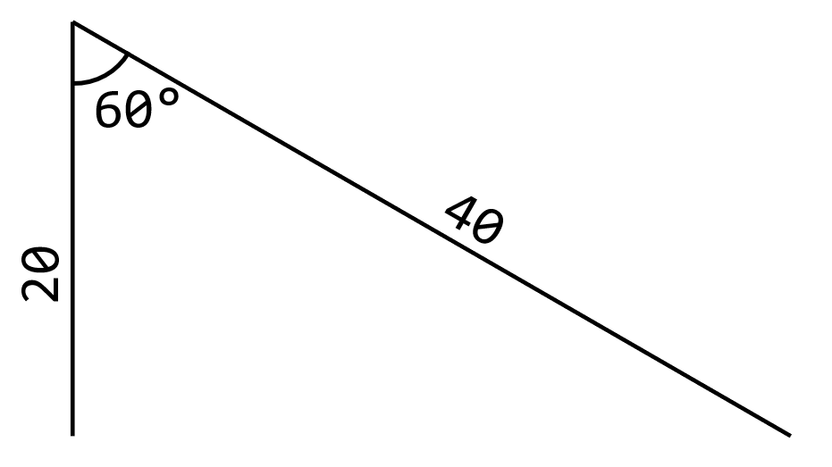

---
sidebar_custom_props:
  id: 350450d5-014a-4821-b95c-bee41c880643
---
import Strukto from '@site/src/components/struktogramm/Strukto';

# Nachholprobe 26e

Erlaubte Hilfsmittel
: Unterrichtsmaterial
: Eigene Skripts
: Webseiten, Google

Verbotene Hilfsmittel
: ⚠️ Fremde Hilfe
: ⚠️ Chats / Kommunikation jeglicher Art


<Solution webKey="12396629-ac7d-4e17-be61-c2271698f9ca" title="Testfragen" open>

## Aufgabe 1
*(3 Punkte)*

Das Programm zeichnet eine Sonne mit 13 Strahlen.
1. Ändern Sie das Programm so ab, dass es nun eine Sonne mit `19` Strahlen zeichnet.
2. Setzen Sie die Stiftdicke auf `5` und die Stiftfarbe auf **Rot**.
3. Füllen Sie die Sonne mit Ihrer Lieblingsfarbe (aber nicht mit Rot) aus.

```py live_py title=aufgabe1.py id=b443e55d-2bb0-4cc3-a892-3e473fd63e9e versioned readonly
from turtle import *

speed(0)

def bogen(distanz, drehung):
    for i in range(20):
        backward(distanz)
        right(drehung)

def strahl():
    bogen(3, 5)
    left(90)
    bogen(4, -10)
    right(190)

for i in range(13):
    strahl()
    right(360 / 13)
```

---

## Aufgabe 2
*(3 Punkte)*

Übersetzen Sie das untenstehende Struktogramm in Python Code

:::cards[--max-width=400px]
<Strukto program={[
    {type: 'step', code: <span><u>90</u>° links</span>},
    {type: 'step', code: <span><u>120</u> Schritte vorwärts</span>},
    {
        type: 'def', 
        code: <span>part</span>,
        block: [
            {type: 'step', code: <span><u>40</u> Schritte vorwärts</span>},
            {type: 'step', code: <span><u>35</u>° rechts</span>},
            {type: 'step', code: <span><u>20</u> Schritte vorwärts</span>},
            {type: 'step', code: <span><u>35</u>° links</span>},
        ]
    },
    {
        type: 'def', 
        code: <span>flower</span>,
        block: [
            {type: 'step', code: <span><u>25</u>° links</span>},
            {
                type: 'repeat', 
                code: <span><u>5</u> mal wiederholen</span>,
                block: [
                    {type: 'step', code: <span><u>60</u> Schritte rückwärts</span>},
                    {type: 'call', code: <span><i>part</i> zeichnen</span>},
                    {type: 'step', code: <span><u>60</u> Schritte vorwärts</span>},
                    {type: 'step', code: <span><u>154</u>° rechts</span>}
                ]
            }
        ]
    },
    {type: 'call', code: 'flower zeichnen'}
]} />
:::

```py live_py title=aufgabe2.py versioned id=28e93632-1425-422a-84f1-ea1a3b3511b4 readonly
from turtle import *
```

---

## Aufgabe 3
**(4 Punkte)**

Finden und korrigieren Sie alle Fehler, so dass die folgende Ausgabe entsteht. Es gibt sowohl Syntaxfehler wie auch Logikfehler.



```py live_py title=aufgabe3.py id=5e3d640e-42e2-4433-ab72-8bdff2421565 versioned readonly
from turtle import *

def rechteck(breite, höhe):
    begin_fill()
    for i in() range(2)
        forward('breite')
        left(90)
        forward(höhe)
        left(90)
    end_fill

color('red')
rechteck(200, 120)
goto(0 50)
color(white)
 rechteck(200, 20)
penup()
goto(50, 0)
pendown()
rechtek(20, 120)

hide_turtle()
```
---

## Aufgabe 4
*(5 Punkte)*

- a) Schreiben Sie ein Programm, welches folgende Zeichnung erzeugt. *(2 Punkte)*


Die Höhe eines Zick-Zacks beträgt `20` Einheiten, die lange Seite ist `40` Einheiten lang und der Innenwinkel beim Zick-Zack beträgt `60°`.



- b) Verwenden Sie Wiederholungen (min. an einem Ort) (*1 Punkt*)
- c) Schreiben Sie für das Zeichnen einer einzelnen Zacke einen (selber definierten) Befehl `zickzack` (*1 Punkt*).
- d) Verwenden Sie einen Parameter `size`, so dass die Höhe des Zickzacks verändert werden kann. Erzeugen Sie so folgende Figur mit den Höhen `20`, `30`, `40` und `50`, ohne dabei Punkt (b) zu entfernen. (*1 Punkt*)


```py live_py title=aufgabe4.py versioned id=82ccb407-9975-4d06-a970-958f587143f0 readonly
from turtle import *
```

---

</Solution>
