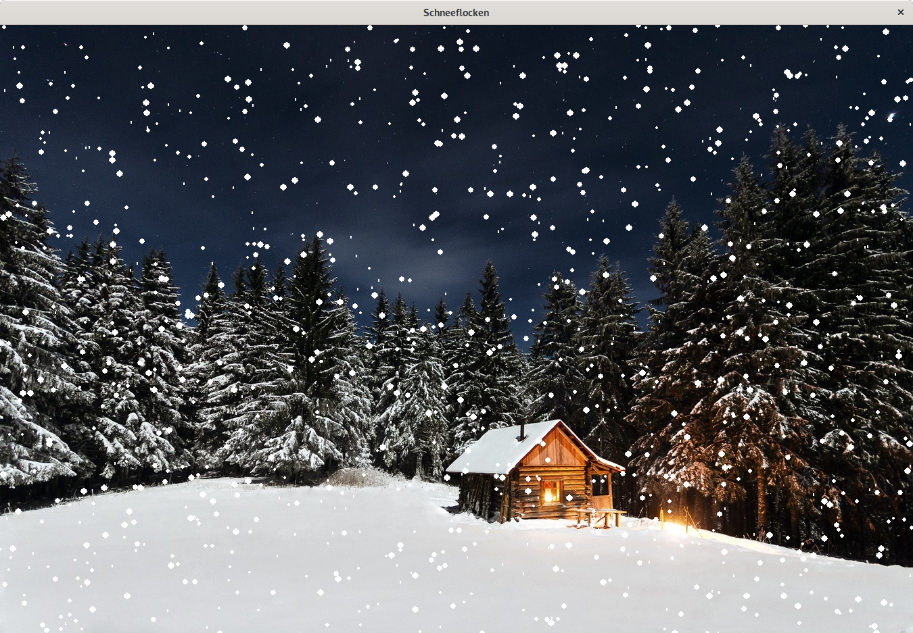
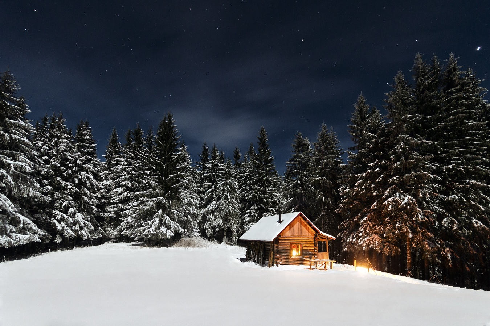
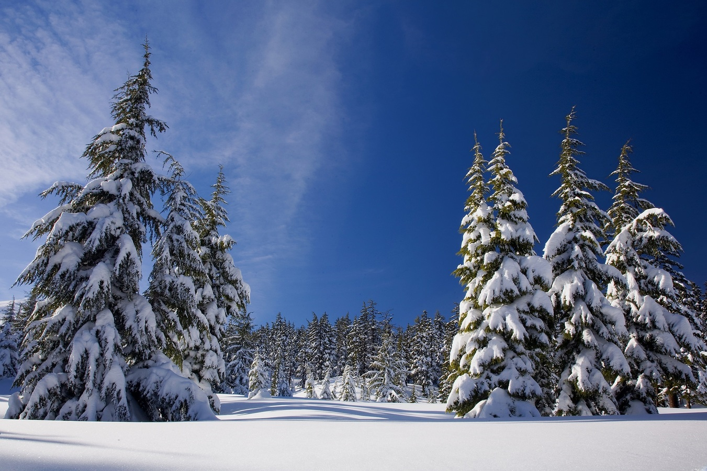

---
sidebar_custom_props:
  id: ad8ae98b-bd14-41f4-85c7-95810e2dbb46
  source:
    name: Tom Jampen
    ref: https://gitlab.gymkirchenfeld.ch/teach/programming-2/-/tree/main/2-lists/3-snow
---

import lsg1 from './solutions/snow-1.raw.py';
import lsg2 from './solutions/snow-2.raw.py';
import CodeBlock from '@theme/CodeBlock';

# Projekt Schneefall



## Repetition Pygame Zero

Wir wollen wieder etwas zeichnen mit Pygame Zero. Hier das Grundgerüst für eine Pygame Zero-Programm:

```python
import pgzrun

TITLE = "Fenstertitel"
WIDTH = 800
HEIGHT = 600

hintergrund = Actor("hintergrundbild")


def draw():
    hintergrund.draw()


def update(zeitdifferenz):
    # Anpassungen von Bild zu Bild
    pass


pgzrun.go()
```

Da wir nun mit Thonny programmieren, muss Pygame Zero importiert (1. Zeile) und gestartet werden (letzte Zeile). Der Mu-Editor im Pygame Zero-Modus hatte dies für uns übernommen.

Damit Pygame Zero überhaupt verwendet werden kann, muss das Paket `pgzero` installiert sein. Dazu öffnen wir im Menü _Extras_ (engl. _Tools_) den Eintrag _Verwalte Pakete..._ (engl. _Manage Packages..._), suchen nach `pgzero` (falls mehrere Resultate auftauchen `pgzero` anklicken) und klicken auf den Installieren-Knopf.

::: info Zur Erinnerung
Bilder, die im Programm verwendet werden, müssen in einem Unterverzeichnis `images` gespeichert sein. Anstelle von `hintergrund` wird der Dateiname ohne Endung angegeben.
:::

## Zeichnen mit Pygame Zero

In der `draw()`-Funktion können nicht nur `Actor` gezeichnet werden, es gibt auch die Möglichkeit, Linien, Rechtecke und Kreise zu zeichnen. Wir beschränken uns hier auf ausgefüllte Kreise, da wir Schneeflocken so darstellen möchten.

```py
screen.draw.filled_circle(position, radius, farbe)

screen.draw.filled_circle((x, y), r, (r, g, b))
```

Dieser Aufruf zeichnet einen ausgefüllten Kreis mit Mittelpunkt `[x, y]` und Radius `r` in der Farbe `[r, g, b]` (die Werte `r`, `g` und `b` müssen zwischen `0` und `255` liegen). Wichtig ist, dass die zusätzlichen Klammern bei der Position und der Farbe geschrieben werden, da die Funktion nur 3 Werte erwartet: die Position, den Radius und die Farbe.


```py
def draw():
    hintergrund.draw()

    screen.draw.filled_circle([100, 200], 10, [255, 0, 0])
```

Dies zeichnet einen rot gefüllten Kreis mit Radius 10 bei den Koordinaten (100, 200).

:::aufgabe Aufgabe – Schneeflocke zeichnen

:::cards
](./images/winter_1.jpg)
***
](./images/winter_2.jpg)
:::

1. Laden Sie eines der obigen Hintergrundbilder herunter und fügen Sie es im Mu-Editor bei den Bildern hinzu.
2. Kopieren Sie die Vorlage für das Pygame Zero-Programm und legen Sie das gewählte Bild als Hintergrundbild fest.
3. Passen Sie die Grösse des Fensters an, so dass das Bild optimal dargestellt wird. Es hat eine Auflösung von `1350x900` Pixel.
4. Zeichnen Sie eine Schneeflocke an einer beliebigen Stelle.

<Solution webKey="8ae90f18-56e3-45fb-b2cb-5e0b35801dc4">

```python
import pgzrun

TITLE = "Schneeflocken"
WIDTH = 1350
HEIGHT = 900

hintergrund = Actor("winter_1")


def draw():
    hintergrund.draw()
    screen.draw.filled_circle([100, 50], 3, [255, 255, 255])


def update(zeitdifferenz):
    # Anpassungen von Bild zu Bild
    pass

pgzrun.go()
```
</Solution>
:::

:::aufgabe Aufgabe – Schneeflocke bewegen

Damit wir die Schneeflocke bewegen können, muss die Position in einer Variablen gespeichert werden, damit sie in der `update()`-Funktion verändert werden kann.

Später wollen wir dann 1'000 Schneeflocken darstellen und somit die Position von 1'000 Schneeflocken speichern. Dies lässt sich nicht mit separaten Variablen pro Schneeflocke realisieren. Listen eignen sich aber perfekt für diese Aufgabe.

Vorerst begnügen wir uns allerdings mit der einen Schneeflocke, die wir bereits haben. Anstatt aber die x- und y-Position als Zahl in einer Variablen zu speichern, verwenden wir bereits eine Liste.

1. Erweitere das Programm so an, dass die x- und y-Koordinate der bestehenden Schneeflocke je in einer Liste gespeichert.
2. Passe die Codezeile zum Zeichnen der Schneeflocke so an, dass die Koordinaten der Schneeflocke aus der Liste geholt werden.
3. Füge eine Zeile in die `update()`-Zeile ein, so dass die y-Koordinate stets verändert wird. Dabei musst du das Schlüsselwort `pass` entfernen, es musste dort stehen, weil eine Funktion nicht leer sein darf.

<Hint>

1. Erstelle zu Beginn des Programms die Listen `schnee_x` und `schnee_y` und speichere darin die Position der ersten Schneeflocke (z.B. `schnee_x = [100]`).
2. Die Koordinaten stehen in beiden Listen an erster Stelle und haben somit Index `0` (`schnee_x[0]`).

</Hint>
<Solution webKey="8ae90f18-56e3-45fb-b2cb-5e0b35801dc4">
<CodeBlock language="python">
{lsg1}
</CodeBlock>
</Solution>
:::

:::aufgabe Aufgabe – mehrere Schneeflocken
Nun wollen wir mehrere Schneeflocken zeichnen. Dazu müssen wir brauchen wir Zufallszahlen als Startposition in der Liste mit den x-Koordinaten. Zudem müssen wir dafür sorgen, dass sämtliche Schneeflocken gezeichnet werden und nicht nicht eine.

1. Lege in einer Variablen fest, wie viele Schneeflocken du zeichnen möchtest.
2. Um die Liste mit den Startkoordinaten zu füllen, brauchen wir eine Schleife, die für sämtliche gewünschten Schneeflocken in einem sinnvollen Bereich eine Startkoordinate zufällig berechnet. Lasse die Liste am Anfang leer und fülle sie direkt anschliessend mit einer Schleife.
3. Füge eine weitere Schleife zum Zeichnen der Schneeflocken ein und passe die x-Koordinate an.
4. Probiere das Programm aus. Was ist jetzt noch falsch, was müssen wir ebenfalls noch ändern?

<Hint>

1. Normalerweise schreibt man Konstanten (also Variablen, deren Wert sich nicht ändert) in Grossbuchstaben.
2. Der sinnvolle Bereich für die x-Koordinate liegt zwischen `0` und der Breite des Fensters. Benutze die Variable und nicht die Zahl direkt.
3. Ersetze `schnee_x[0]` durch `schnee_x[i]`, wobei `i` deine Schleifenvariable ist.
4. Es gibt 2 Dinge zu korrigieren.
   1. Auch die y-Koordinaten müssen am Anfang zufällig gesetzt, beim Zeichnen individuell verwendet und in der `update()`-Funktion individuell verändert werden, sonst kommt der Schnee als Linie herunter.
   2. Zudem sollten diejenigen Schneeflocken, die unten am Bildrand ankommen, sofort wieder neu von oben kommen, sonst dauert der Schneefall nur kurz.

</Hint>

<Solution webKey="8ae90f18-56e3-45fb-b2cb-5e0b35801dc4">
<CodeBlock language="py">
{lsg2}
</CodeBlock>
</Solution>

:::

:::aufgabe ⭐ Zusatzaufgabe – Schneeflocken verschönern
Hier einige Ideen, wie du die Schneefall-Animation noch verbessern könntest:

- Nicht alle Schneeflocken sollen gleich gross sein.
- Die grösseren Flocken sollen schneller fallen (dies erzeugt einen leichten 3D-Effekt).
- Die Schneeflocken, die neu von oben kommen, sollen eine neue zufällige x-Koordinate erhalten.
:::
