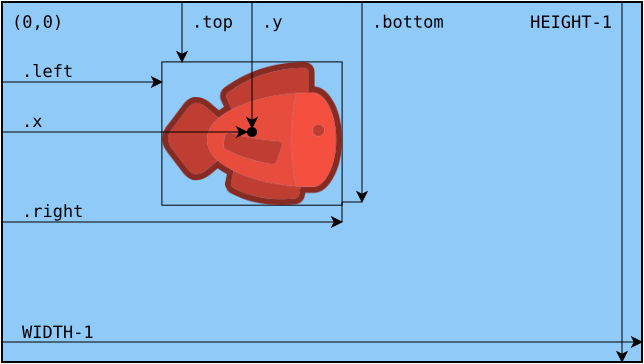

---
sidebar_custom_props:
  id: eeea4e4a-d18d-45ff-b947-3eb2cfcd6bb8
  source:
    name: Gym-Kirchenfeld
    ref: https://gitlab.gymkirchenfeld.ch/teach/ref/-/tree/main/pgzero
---
# Aktor
---

## Grundlegendes

```py
nemo = Actor(bild)
```
erstellt einen neuen Aktor. `bild` ist der Name einer Bilddatei.

```py
nemo.draw()
```
zeichnet den Aktor `nemo` in das Fenster.

## Position



```py
nemo.bottom
```
ist die y-Koordinate des unteren Rands von `nemo`.

```py
nemo.left
```
ist die x-Koordinate des linken Rands von `nemo`.

```py
nemo.right
```
ist die x-Koordinate des rechten Rands von `nemo`.

```py
nemo.top
```
ist die y-Koordinate des oberen Rands von `nemo`.

```py
nemo.x
```
ist die x-Koordinate des Ankers von `nemo`.

```py
nemo.y
```
ist die y-Koordinate des Ankers von `nemo`.

```py
nemo.angle
```
ist die Rotation von `nemo` in Grad im Gegenuhrzeigersinn.

## Kollision

```py
nemo.collidepoint(x, y)
```
überprüft, ob `nemo` mit dem Punkt mit den Koordinaten `x`, `y` kollidiert.

```py
nemo.collidepoint(pos)
```
überprüft, ob `nemo` mit dem Punkt mit den Punkt `pos` kollidiert. So kann beispielsweise überprüft werden, ob ein Aktor mit der Maus angeklickt wird:

```py
def on_mouse_down(pos):
    if nemo.collidepoint(pos):
        print("Nemo mit Maus berührt.")
```

```py
nemo.colliderect(dory)
```
überprüft, ob `nemo` mit `dory` kollidiert.

```py
nemo.collidelist(liste)
```
überprüft, ob `nemo` mit einem Aktor in der Liste `liste` kollidiert. In dem Fall wird der Index des kollidierenden Aktors in der Liste zurückgeliefert. Wenn kein Aktor der Liste mit `nemo` kollidiert, wird `-1` zurückgeliefert.

## Messung

```py
nemo.distance_to(dory)
```
misst die Distanz zwischen `nemo` und `dory`.

```py
nemo.angle_to(dory)
```
misst den Winkel von `nemo` aus in Richtung `dory`.
