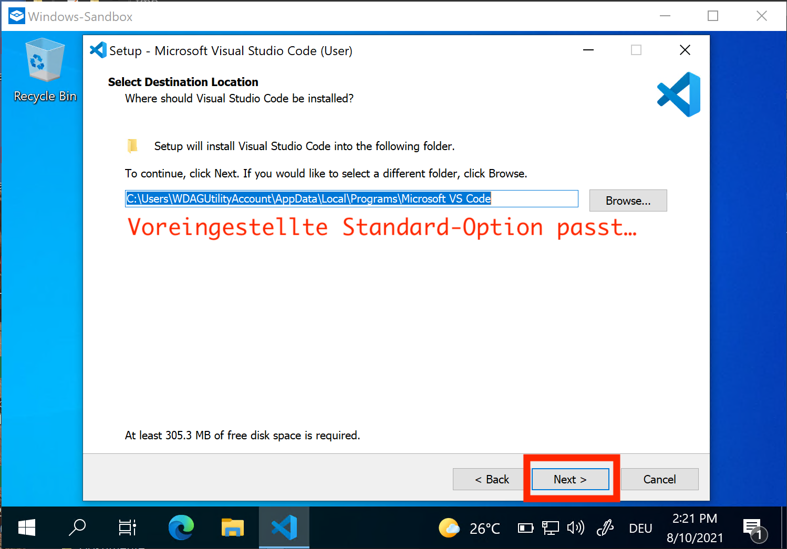
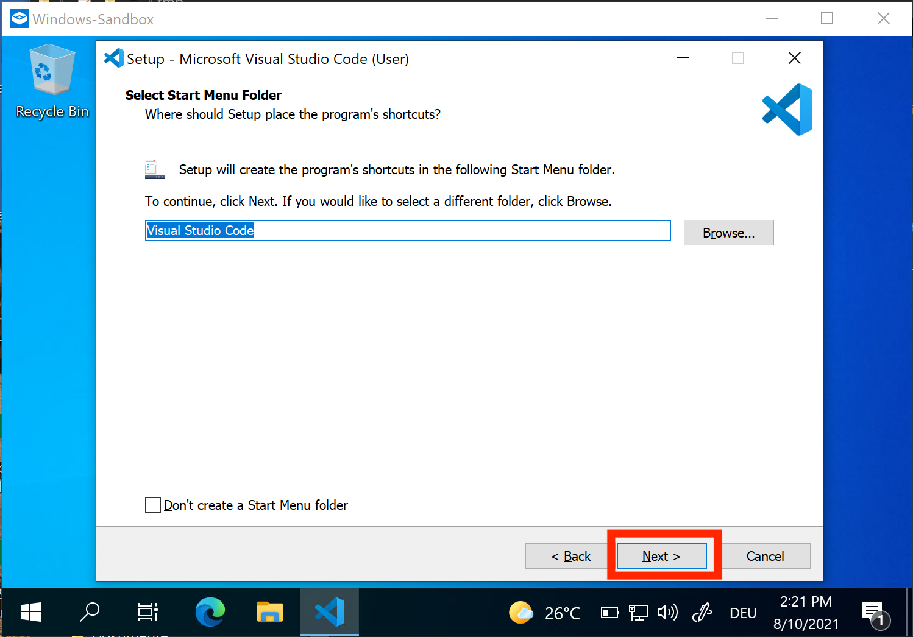
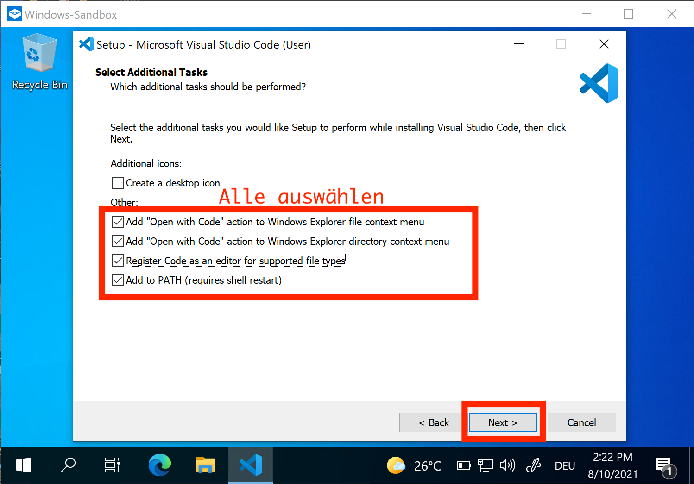
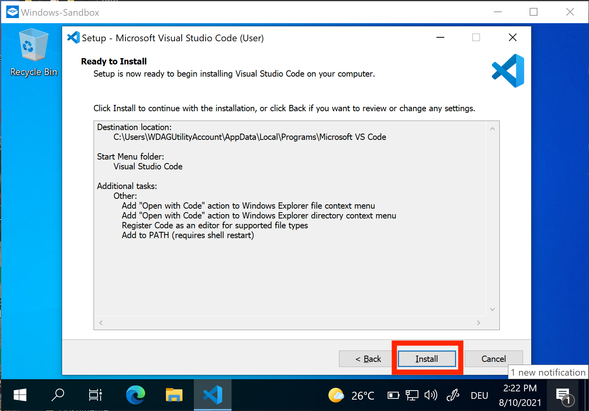
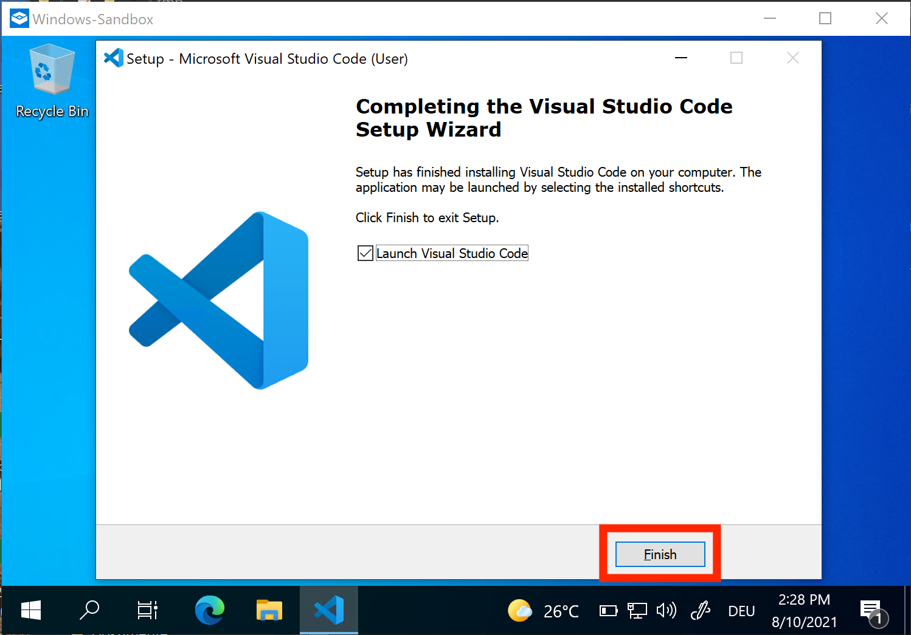
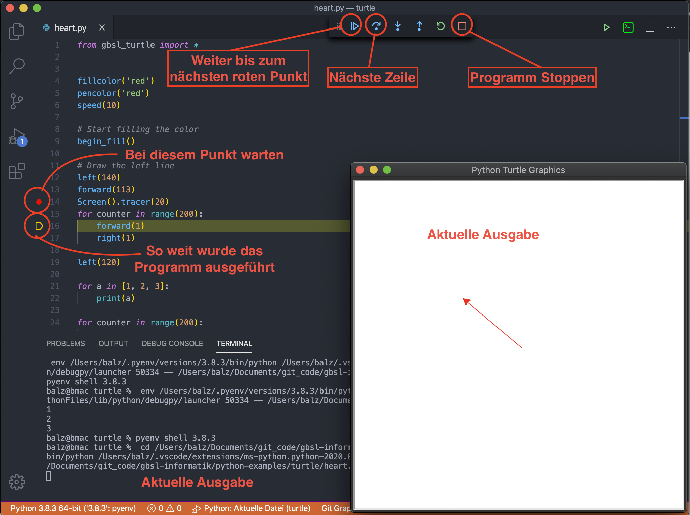

---
sidebar_custom_props:
  id: a241d178-8c66-4f90-9469-8ca558bd7a26
---

# VS Code 1.59

import OsTabs from '@site/src/components/OsTabs'


# VS Code

> Visual Studio Code (kurz VS Code) ist ein kostenloser und Quelloffener Editor von Microsoft. VS Code ist plattformübergreifend für die Betriebssysteme Windows, macOS und Linux verfügbar. [^1]


## Installieren

1. Unter [https://code.visualstudio.com/](https://code.visualstudio.com/Download) die aktuelle Version von Python herunterladen. 
    - Surface Pro X -> `ARM`
    - Windows -> `64 bit`
    - Mac mit M1 Chip -> `Apple Silicon`
    - Mac OS -> `Intel Chip`
    
2. Die heruntergeladene Datei doppelklicken
3. Folgende Optionen bei der Installation berücksichtigen:

<details>
<summary>Installations-Optionen</summary>
<OsTabs>
<TabItem value="win">

1. Schritt: 
2. Schritt: 
3. Schritt: 
4. Schritt: 
5. Schritt: 
6. Schritt: 
7. Schritt: 
5. Fertig 🥳

</TabItem>
<TabItem value="mac">

1. Die heruntergeladene Datei ist eine komprimierte `.zip`-Datei - nach dem Doppelklicken befindet sich im Download-Ordner eine Datei `Visual Studio Code.app``
2. Die Datei `Visual Studio Code.app` in den Ordner "Programme" ziehen.
3. Beim ersten Öfnnen kommt folgender Hinweis:
    
4. Fertig 🥳

</TabItem>
</OsTabs>
</details>

---

## Konfigurieren

Damit die richtigen Voreinstellungen geladen werden, muss eine Erweiterung, ein sog. Plugin, installiert werden. Unter `Erweiterungen` nach dem Plugin **gbsl-informatik** suchen und dieses installieren.


### Python Interpreter

Um Python-Programme auszuführen, ist ein Übersetzer der Befehle zu Maschinenverständlichem Code notwendig. Diese Aufgabe übernimmt der **Python Interpreter**. Auf einem Gerät sind meist mehrere verschiedene Python-Interpreter installiert - in VS Code soll aber der von uns installierte Interpreter verwendet werden:

<OsTabs>
<TabItem value="win">

:::info
Es muss immer überprüft werden, dass der von uns installierte Interpreter ausgewählt ist.
:::


</TabItem>
<TabItem value="mac">

:::info
Der **zuletzt** installierte Python-Interpreter ist jeweils unter `/usr/local/bin/python3` (in der zweiten Zeile vermerkt) verfügbar. Es muss immer überprüft werden, dass dieser Interpreter ausgewählt ist.
:::


<details>
<summary>Eine andere Version verwenden</summary>

Unter `/Library/Frameworks/Python.framework/Versions/` sind alle Python-Versionen verfügbar. Beim Konfigurieren des Interpreters kann über `Enter interpreter path...` auch dieser Pfad angegeben werden.

Beispiel-Pfad für die Version 3.9:

```sh
/Library/Frameworks/Python.framework/Versions/3.9/bin/python3.9
```

</details>

</TabItem>
</OsTabs>

<details>
<summary>Welcher Interpreter wird aktuell verwendet?</summary>

Mit folgendem Python-Programm kann man herausfinden, wo sich der Python Interpreter befindet:

```py
import sys
print(sys.executable)
```

</details>


## Verwenden

In VS Code lassen sich einzelne Dateien oder Ordner öffnen. Damit alle relevanten Dateien beim Ausführen von Python-Programmen von VS Code gefunden werden, sollten immer ganze Ordner geöffnet werden.


### 1. Wo ist was?

Alle im moment geöffneten Programme sind auf der linken Seite im Dateiexplorer zu sehen.


### 2. Python Befehle ausprobieren


### 3. Einen Ordner öffnen

Öffnen Sie jeweils einen ganzen Ordner, in welchem sich Ihre Python Scripts befinden.


### 4. Ein neues Python Script erstellen

Um ein neues Python Script hinzuzufügen, klicken Sie "New File". Wichtig: **Die Dateiendung des Skripts muss `.py` sein!**


### 5. Einzelne Programm-Schritte nachvollziehen (debuggen)




[^1]: Quelle: [wikipedia](https://de.wikipedia.org/wiki/Visual_Studio_Code)
